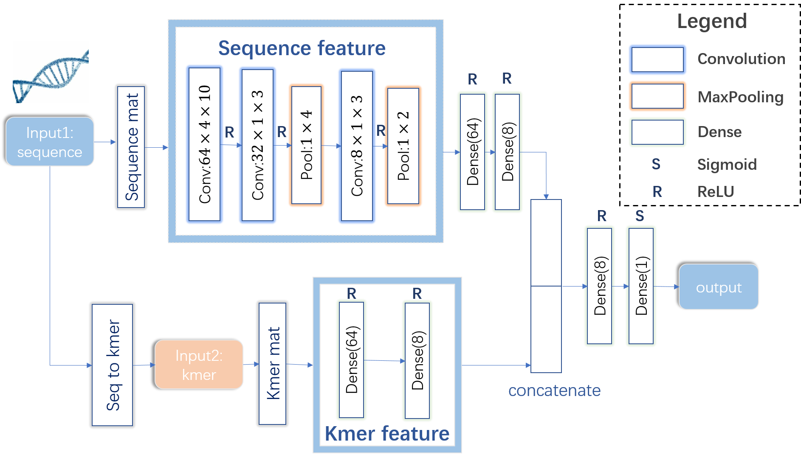
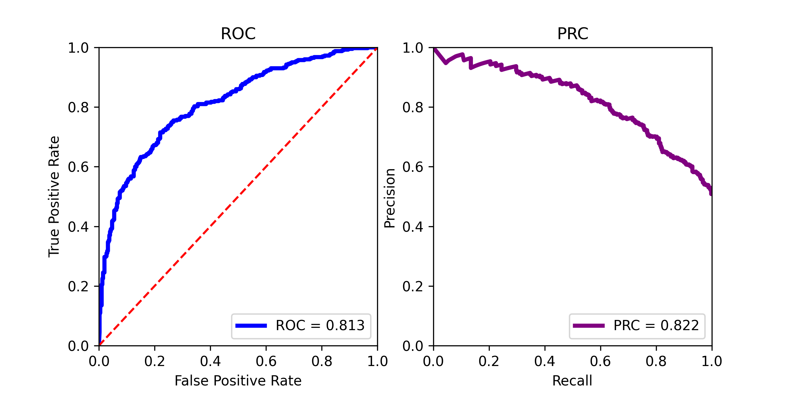

# DeepSilencer
#### A deep convolutional neural network for the accurate prediction of silencers
For accurate classification of silencers, we propose a CNN-based model named DeepSilencer. As illustrated in the following figure, DeepSilencer consists of four modules. First, a data-processing module transforms DNA sequences into matrices of sequences and counts of kmers. Second, a CNN module uses a convolutional neural network (CNN) with multiple convolutional and pooling layers to extract features from matrices of DNA sequences. Third, an ANN module is adopted to sufficiently learn the characteristics of kmers. Finally, a joint module integrates outputs of the CNN and ANN modules to predict the probability.
<div align=center>

</div>   
    
## Installation  

```  
Requiements:  
1. Python 3.5 or later version  
2. Packages:  
    numpy (>=1.15.1)  
    keras (2.3.1)  
    tensorflow(-gpu) (1.15.2)  
    hickle (>=3.4)
  
Package installation:
  
$ pip install -U numpy  
$ pip install keras == 2.3.1 
$ pip install tensorflow-gpu==1.15.2 #pip install tensorflow==1.15.2  
$ pip install -U hickle  
$ git clone https://github.com/xy-chen16/DeepSilencer.git   
$ cd DeepSilencer    
```

## Data Preprocessing

### Load the genome files:
```  
$ cd data 
$ mkdir -p genome/mm10 && cd genome/mm10
$ nohup wget http://hgdownload.cse.ucsc.edu/goldenPath/mm10/bigZips/chromFa.tar.gz
$ tar zvfx chromFa.tar.gz
$ cd ..
$ mkdir hg19 && cd hg19
$ nohup wget http://hgdownload.cse.ucsc.edu/goldenPath/hg19/bigZips/chromFa.tar.gz
$ tar zvfx chromFa.tar.gz 
$ cd ../../..
```
### Unzip the open region files and result files:
```  
$ tar -xjvf data/open_region.tar.bz2 -C data
$ tar -xjvf result/result.tar.bz2 -C result
```
## Tutorial   
We collected the uncharacterized cis-regulatory elements (CREs) in K562 cells with MPRA provided by Jayavelu et al. Then we chose the top 2000 uncharacterized CREs sequences with the lowest MPRA activity as a positive set, and the bottom 2000 uncharacterized CREs with highest MPRA activity as a negative set. We also downloaded the uncharacterized CREs in homo sapiens and mus musculus without the value of MPRA, and we further use these sequences to find the candidate silencer.  
### self-projection  
For demonstrating the classification performance of DeepSilencer, we conducted the self-projection experiment and compared our method with the gapped k-mer SVM (gkmSVM). We randomly selected 80% of the data as trainning set and used the remaining 20% of data for testing the two models.
```   
$ python code/run_self_projection.py
```
The performance of DeepSilencer was shown in the following Figure.
<div align=center>

</div>   

The performance of two methods was shown in the following table.

<table>
<tr>
    <th>Method</th>
    <th>AUC</th>
    <th>PRC</th>
</tr>
<tr>
    <th>DeepSilencer</th>
    <th>0.827*</th>
    <th>0.842*</th>
</tr>
<tr>
    <th>gkmSVM</th>
    <th>0.81</th>
    <th>0.76</th>
</tr>
</table>

### crossdataset-projection 
In order to find the candidate silencer elements in homo sapiens and mus musculus, we trained the DeepSilencer model based on the whole sequences using in the self-projection experiments. First, we trained the model: 

```   
$ python code/train_for_crossdata_projection.py
```
Predict the candidate silencer elements in homo sapiens (hg19): 
```   
$ python code/run_crossdata_projection_human.py
```
Predict the candidate silencer elements in mus musculus (mm10): 
```
$ python code/run_crossdata_projection_mouse.py
```
Then you can check the results in the *results* folder.

